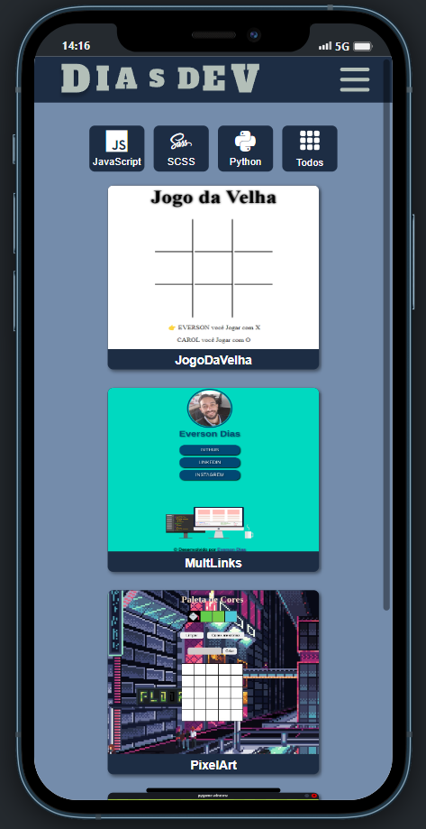

# My Portfolio


## Tecnologias utilizadas


# Índice

* [Título e Imagens Home](#my-portfolio)
* [tecnologias utilizadas](#tecnologias-utilizadas)
* [Índice](#índice)
* [Descrição do projeto](#descrição-do-projeto)
* [Status do Projeto](#status-do-projeto)
* [Funcionalidade do projeto](#🔨-funcionalidade-do-projeto)
* [Acesso ao Projeto](#acesso-ao-projeto)

# Descrição do Projeto

Este projeto é um WebSite onde falo um pouco de mim e utilizo para catalogar e organizar meus projetos.

Neste app utilizo a API do github para ter acesso ao meu repositório e informações deles como github page e linguagem utilizada.

App responsivo com opção de trocar o tema.



# Status do Projeto

> 💹 Alpha 💹

# 🔨 Funcionalidade do projeto

- Troca de Tema
- filtra os projetos pela linguagem dominante
- detalhes como descrição de projetos e github pages


# Acesso ao projeto

você precisa ter Instalado o npm e o nodejs.

1° Clone o Projeto

```bash
git clone git@github.com:EversonDias/myPortfolio.git 
```

2° Entre no projeto

```bash
cd myPortfolio
```

3° Instale as dependências

```bash
npm install
```

4° inicie o projeto

```bash
npm start
```

ou acesse através do link

* [web site](https://my-portfolio-eversondias.vercel.app/)
